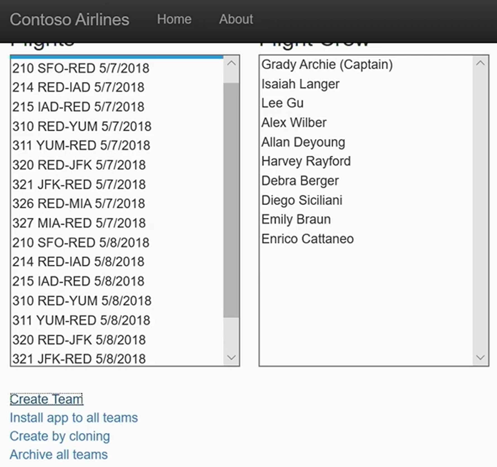
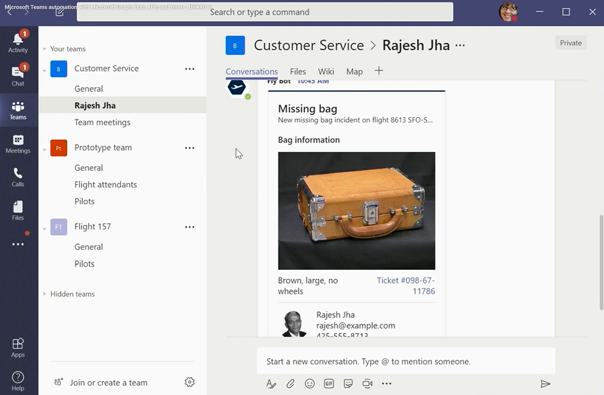
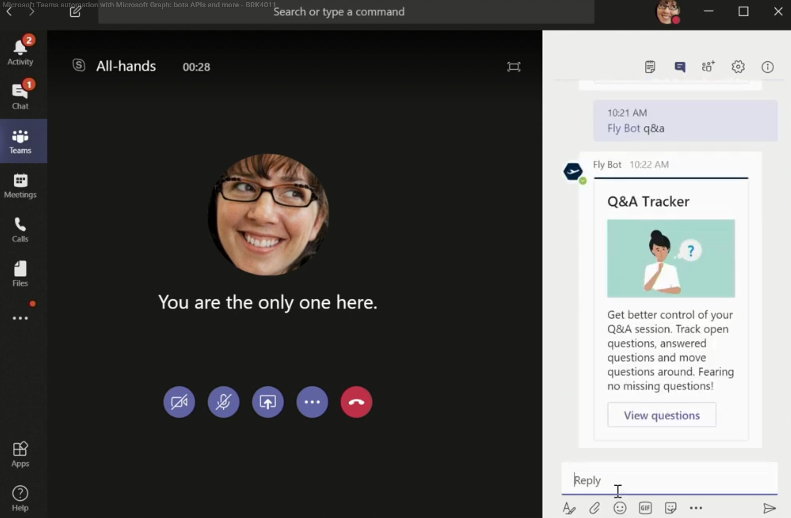

# Teams Graph API Demos from Build 2019

Demos of the Microsoft Teams Graph APIs as presented at Microsoft Build 2019 
(Microsoft Teams automation with Microsoft Graph: bots APIs and more - BRK4011).

## Provisioning and automated teams lifecycles

Demonstrates REST Apis to create single purpose teams and channels that are archived when you're done with them. 

[Watch the video.](https://youtu.be/ybGm1qWVi-k?si=C8nztrCrMLNVINSP&t=365)

## Bots using Graph

Demonstrates calling Graph APIs from within a bot.

[Watch the video.](https://youtu.be/ybGm1qWVi-k?si=1XMsOm6bAG-OYqiX&t=2081)

## Read message APIs

Demonstrates calling the graph messaging APIs from within a meeting.

[Watch the video.](https://youtu.be/ybGm1qWVi-k?si=dKypjYQg9qszcsxU&t=3125)
